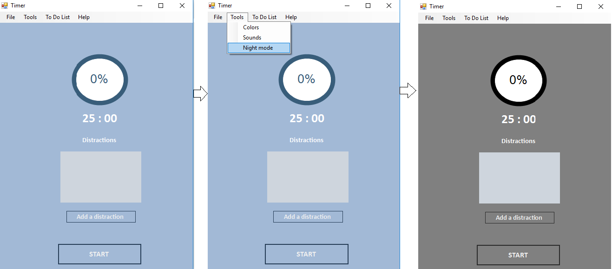
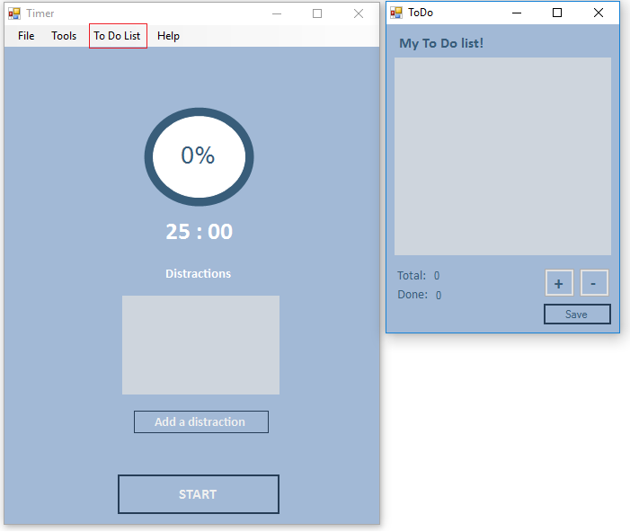
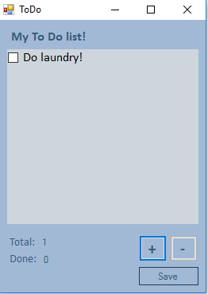
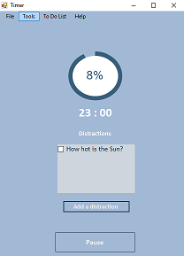

# Pomodoro
Проектна задача по Визуелно Програмирање

Помодоро Апликација
# 1.	Опис на апликацијата

Pomodoro е апликација чие што име се заснова на името на соодветната техника која треба да овозможи најефикасно искористување на времето. Правилата со кои се служи техниката се истите оние кои оваа апликација ги побарува, а тие се следните:
•	Најди листа на задачи кои сакаш да ги завршиш во текот на денот
•	Избери една од нив
•	Работи на истата се до истекот на тајмерот
•	Доколку задачата на која си работел е завршена, означи ја како готова
•	Одмори кога ќе поминеш еден Помодоро циклус
•	Повтори го процесот повторно, онолку број на пати колку што е потребно

## 1.1.	 Начин на користење на апликацијата





# 2.	Опис на решението

## •	Circular Progress Bar
Circular Progress Bar  е custom user control што значи дека може да се постави со drag-and-drop од Toolbox. Во него се progress (за timer-от) кој се користи во двата методи кои што се за исцртување и ажурирање на истиот. Начинот на кој што се употребува е преку Threads кои што се манипулираат преку нивно стартување и паузирање. 
## •	Timer
Timer класата содржи Progress Bar (pbTime), Timer (timer1), неколку flag-ови (wasPaused, flag, nightMode), menuStrip и неколку листи. Главно во оваа класа се справуваме со event-ите при клик на копчиња, менување на боја и отчукување на timer-от. 

## •	Clock class
Clock class е помошна класа во која што чуваме минути и секунди со кои ја симулираме работата на дигитален часовник. Оваа класа се користи за манипулирање на времето кое е поминато во Timer класата. 

## •	Distraction
Служи за додавање на задачи кои се појавуваат во текот на работата со апликацијата, каде задачите се обични стрингови кои што се додаваат во CheckBox List. 

## •	ToDo
Е форма каде што се чуваат задачите кои треба да се извршат во текот на еден Pomodoro циклус. Се чува листа од сите задачи кои ги имаме поставено и кои што сме ги завршиле. Има опција за додавање и бришење на задачите. 

## •	Pauza
Формата Pauza се појавува откако ќе заврши еден циклус од 25 минути. Постои опција паузата да се започне или да се исклучи формата што би значело откажување на паузата. Дополнително, траењето на паузата е одредено со бројот на помодоро циклуси кои се завршени.

# 3.	Опис на одредени функции и класи од изворниот код
```c#
private void btnStartStop_Click(object sender, EventArgs e) {
            flag = !flag;
            if(flag) {
                btnStartStop.Text = "Pause";
                timer1.Start();
            }
            else {
                btnStartStop.Text = "Start";
                timer1.Stop();
            }

            if(clock.actualSec == 0 && clock.minutes == 0) {
                clock.restart();
                label2.Text = clock.ToString();
            }

            Task.Factory.StartNew(() => {

                 for(int num = progress; num <= 100; num++) {

                     if(!flag) {
                         wasPaused = true;
                     }
                     else {
                         new System.Threading.Thread(new System.Threading.ParameterizedThreadStart(this.ProgressUpgrade)).Start(num);

                         if(wasPaused) {
                             System.Threading.Thread.Sleep(tempCounter);
                             wasPaused = false;
                         }
                         else {
                             System.Threading.Thread.Sleep(counter);
                         }

                     }
                 }

             });

            progress = pbTime.progress;
        }
```
Соодветниот код претставува event handler со кој се управува со timer-от и progress bar-от. Во него се чува flag со кој се проверува дали треба да биде паузиран timer-от или истиот да работи како и progress bar-от. Врз основа на flag-от се ажурира и текстот на копчето.  Во овој дел се справуваме и со паузирањето и повторното стартување на timer-от, во смисол каде што работата на progress bar-от треба или да се паузира или истата да продолжи. За таа цел се користи flag-ot wasPaused и помошната променлива tempCounter која означува уште колку време Thread-от треба да “спие”. 

```c#
class Clock {
        public int minutes { get; set; }
        public int actualSec { get; set; }
        public int showSec { get; set; }
        public bool firstRound;
        public int pomoshniMin;

        public Clock() {
            minutes = 25;
            showSec = 0;
            actualSec = 60;
            firstRound = true;
        }

        public Clock(int minutes) {
            this.minutes = minutes;
            showSec = 0;
            actualSec = 60;
            pomoshniMin = minutes;
            firstRound = true;
        }

        public void clockTick() {
            if(firstRound) {
                minutes = minutes-1;
                firstRound = false;
            }
            checkTransfer();
            showSec = actualSec;
        }

        public void checkTransfer() {
            if(actualSec == 0) {
                changeMinute();
                actualSec = 59;
            }
            else
                actualSec--;
        }

        public void changeMinute() {
            if(minutes > 0)
                minutes--;
            else {
                restart();
            }
        }

        public void restart() {
            minutes = pomoshniMin;
            showSec = 0;
            actualSec = 60;
            firstRound = true;
        }

        public override string ToString() {
            return string.Format("{0:00} : {1:00}", minutes, showSec);
        }
    }    
```


Дадениот код е репрезентација на класата Clock. Во неа има функции кои служат за манипулирање на работата на timer-от кој треба да работи со еден Pomodoro циклус, затоа минутите се предефинирани на вредност 25. Функцијата checkTransfer() служи за проверка од потребата на смена на минутите, а доколку истата постои, тогаш се повикува функцијата changeMinute() која е одговорна за акцијата која треба да се превземе. По истекот на тајмерот, потребно е негово рестартирање за кое е одговорна функцијата restart().


## Изработиле:
### Марија Трајкова 151047
### Александар Стојановиќ 151088


